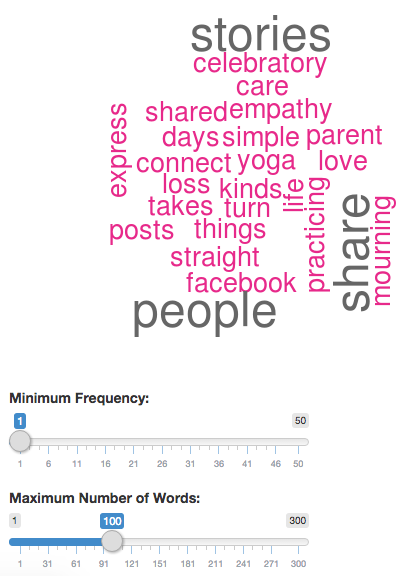

## Overview

This slide was built as part of Coursera: Developing Data Product assignment.

Live demo for produced app is available at: [https://epydermis.shinyapps.io/shinyApp/](https://epydermis.shinyapps.io/shinyApp/)

Source code for Shiny App is available at: [https://github.com/mhafizhasan/coursera-shiny-app](https://github.com/mhafizhasan/coursera-shiny-app)

--- .class #id 

## Dataset

This apps doesn't use any spesific dataset and depends on input by user.

---

## How to

1. User needs to type in or paste some words into the provided text area.
2. Once completed, press the **Process** button to begin the processing job.

For the purpose of demo, i simulate user input by reading a sample txt file as below:


```r
readChar("sample.txt", file.info("sample.txt")$size)
```

```
## [1] "I come to Facebook to share all kinds of things with people I care about — from celebratory posts about practicing yoga for 60 days straight, to mourning the loss of a parent. Those same people who connect with me on my stories also have their own stories to share. Sometimes we just want a simple way to say we really love what they shared, or to express empathy when life takes a turn."
```

---

## Output

This is a sample output for our demo simulator from previous slide:



User can filter the output such as frequencies and words limit using slider.


